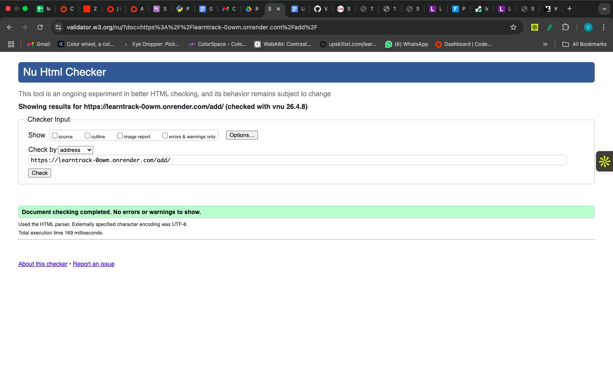
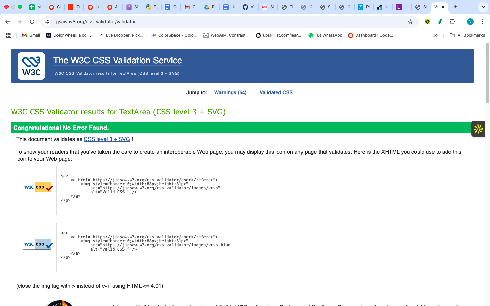
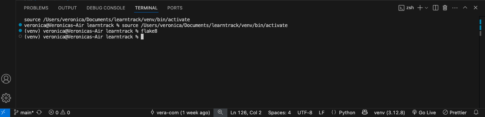

# LearnTrack

## 📌 Table of Contents

- [Overview](#overview)
- [Project Goals](#project-goals)
- [User Experience](#user-experience)
- [Target Users](#target-users)
- [User Stories](#user-stories)
- [MoSCoW Prioritisation](#moscow-prioritisation)
- [Features](#features)
- [Data Model](#data-model)
- [Technologies Used](#technologies-used)
- [Design](#design)
- [Colour Palette and Design Choices](#colour-palette-and-design-choices)
- [Wireframes](#wireframes)
- [Challenges and Solutions](#challenges-and-solutions)
- [Testing](#testing)
- [Deployment](#deployment)
- [Credits](#credits)

---

## Overview

LearnTrack is a Django-based web application designed to help users track and manage their study sessions in an organised and structured way.

This application was developed to address the challenge of tracking learning progress effectively, ensuring users can organise and monitor their study sessions in one place.

The aim is to keep everything in one place and provide a clear overview of learning progress.

## Live Project

The deployed application can be accessed here:  
👉 https://learntrack-0owm.onrender.com/


## Repository

The GitHub repository can be accessed here:  
👉 https://github.com/Vera-com/learntrack


---

## Project Goals

The main goal of this project is to create a simple and user-friendly study tracker that allows users to:

- Add new study sessions
- View all recorded sessions
- Edit existing sessions
- Delete sessions when no longer needed
- Maintain consistency in learning
- Track personal progress over time

---

## User Experience

The application was designed with simplicity and clarity in mind.

- Study sessions are displayed in a card layout for better readability
- Navigation is straightforward and intuitive
- Confirmation prompts prevent accidental deletion
- Success messages provide feedback after actions
- The application is fully responsive across mobile, tablet, and desktop devices

---

## Target Users

This application is suitable for:

- Students
- Self-learners
- Online course participants
- Anyone trying to stay consistent with learning

---

## User Stories

- As a user, I want to add a study session so I can track what I’ve learned
- As a user, I want to view all my sessions to review my progress
- As a user, I want to edit sessions to correct mistakes
- As a user, I want to delete sessions I no longer need

---

## MoSCoW Prioritisation

### Must Haves

- Add new study sessions
- View all sessions
- Edit sessions
- Delete sessions
- Store data in a database
- Responsive design

### Should Haves

- Delete confirmation prompt
- Success messages
- Clean UI with Bootstrap cards
- Date picker

### Could Haves

- Dark mode
- Search or filter
- Dashboard analytics
- User authentication
- Export data

---

## Features

- Clean and intuitive user interface focused on usability
- Full CRUD functionality (Create, Read, Update, Delete)
- Study sessions displayed using Bootstrap cards
- Fields include title, course, duration, date, and description
- Dropdown for course selection
- Date picker for improved usability
- Delete confirmation using JavaScript and Django confirmation flow
- Responsive layout across all devices
- Custom styling applied for improved presentation
- Favicon added for branding
- Success messages displayed after actions

---

## Data Model

### Course

- Name (CharField)

### StudySession

- Course (ForeignKey → Course)
- Title
- Description
- Duration
- Date

### Relationship

Each study session is linked to a course, allowing:

- Multiple sessions per course
- Easy categorisation and organisation

---

## Technologies Used

- HTML
- CSS
- Bootstrap 5
- Python
- Django
- PostgreSQL (production)
- SQLite (development)
- Git & GitHub
- Render
- Chrome DevTools
- Lighthouse
- Flake8
- Autoprefixer

---

## Django Implementation

Django was used as the core backend framework to build the application and manage data flow between the database and user interface.

- **Models:**  
  Django models were used to define the database structure for `Course` and `StudySession`, establishing relationships using foreign keys.

- **Views:**  
  Views were implemented to handle user requests, process form data, and control application logic such as creating, updating, and deleting study sessions.

- **Templates:**  
  Django templates were used to render dynamic content on the frontend, allowing study session data to be displayed using loops and template tags.

- **Forms:**  
  Django forms were used to handle user input, validate data, and simplify form processing.

- **URLs:**  
  URL patterns were configured to connect user actions to the appropriate views, enabling navigation throughout the application.

- **Messages Framework:**  
  Django’s built-in messaging system was used to display success messages after actions such as adding, editing, or deleting sessions.

- **Database:**  
  SQLite was used during development, while PostgreSQL was used in production to ensure data persistence on Render.

This structure follows Django’s Model-View-Template (MVT) architecture, ensuring a clean separation of concerns and maintainable code.


## Design

The design focuses on clarity, usability, and a clean learning-focused layout.

- Card layout used for structured display of sessions
- Bootstrap used for responsive grid and navigation
- Consistent spacing and alignment applied across pages
- Forms styled for readability and simplicity
- Navigation kept minimal to avoid clutter

---

## Colour Palette and Design Choices

The colour scheme for LearnTrack was selected to create a clean, modern, and approachable interface while maintaining readability and good contrast.

- **Background:** A soft pale blue / off-white background was used to keep the interface light and calm, reducing visual fatigue.
- **Navbar:** A dark navy gradient was used in the navigation bar to create contrast, give the application structure, and make the branding stand out clearly.
- **Headings:** A deep blue tone was used for headings to create a professional and consistent visual hierarchy.
- **Buttons:**  
  - Green was used for positive actions such as Add and Save  
  - Red was used for Delete to clearly indicate destructive actions  
  - Blue was used for secondary emphasis and highlights
- **Cards:** Soft pink, blue, and green card backgrounds were used to create variety and visual interest without making the interface distracting or overwhelming.

These choices were made to balance simplicity, clarity, and a better user experience.

---

## Wireframes

Wireframes were created during the planning stage to define the page layout, user flow, and placement of CRUD actions before development began.


*Figure: Wireframe showing the main study session list, navigation, action buttons, and responsive mobile layout.*

The final implementation closely follows this structure, with small improvements made during development for responsiveness, spacing, and usability.


## Challenges and Solutions

### 1. Form Submission and Data Saving

**Issue:** Form data was not saving correctly.

**Solution:** The form was connected properly using `request.POST`, and validation was handled using `form.is_valid()` before saving.

---

### 2. Redirect After Form Submission

**Issue:** The page did not redirect after a successful form submission.

**Solution:** Django’s `redirect()` function was used to return users to the study session list page.

---

### 3. Template Structure Confusion

**Issue:** Understanding how `base.html` and template inheritance worked was initially confusing.

**Solution:** Templates were structured properly inside `templates/tracker/` and connected using `` so all pages could share a consistent layout.

---

### 4. Static Files Not Loading Properly

**Issue:** CSS was not applying correctly at one stage.

**Solution:** Static files were configured correctly, and `` was used with the proper static paths.

---

### 5. Date Input Format Issue
The date field required manual input in a specific format, which was not user-friendly.

**Solution:**  
I improved the user experience by adding a date picker widget in `forms.py` using:
```python
widgets = {
    'date': forms.DateInput(attrs={'type': 'date'})
}
```
This allowed users to select dates easily from a calendar instead of typing manually.

---

### 6. Understanding Django Project Structure

**Issue:** It was initially difficult to understand how models, views, URLs, and templates connect together.

**Solution:** Building the project step by step helped clarify how data flows from the database to the frontend.

---

### 7. Delete Functionality and User Experience

**Issue:** The delete process initially felt slow.

**Solution:**
- Added JavaScript confirmation prompt  
- Retained Django confirmation page as backup  
- Added success messages for user feedback  

---

### 8. Responsive Layout Issues

**Issue:** Layout did not display properly on smaller screens.

**Solution:** Bootstrap grid system was used to ensure responsiveness across all devices.

---

### 9. Favicon Clarity Issue

**Issue:** Favicon appeared blurry.

**Solution:** Replaced with a properly scaled and optimised icon.

---

### 10. Data Persistence in Production

**Issue:** SQLite database does not persist on Render.

**Solution:** PostgreSQL was used in production to ensure data persistence.

---

## Testing

Testing was carried out across local and deployed environments.

### Key Areas Tested

- CRUD functionality  
- Form validation  
- Responsiveness  
- HTML validation  
- CSS validation  
- Python (PEP8) validation  
- Deployment  
- Lighthouse testing  

### HTML Validation



*Figure: HTML validated using W3C Nu HTML Checker with no errors*

---

### CSS Validation



*Figure: CSS validated using W3C CSS Validator with no errors*

---

### PEP8 Validation

Flake8 was used to validate all Python files to ensure adherence to PEP8 standards.  
No errors or warnings were found after refactoring long lines in the settings file.



*Figure: Flake8 validation showing no errors or warnings*

### Lighthouse Testing

- Desktop performance scores were high  
- Mobile performance scores were lower due to third-party CDN resources (Bootstrap and Bootstrap Icons)  

Despite this:

- The application is fully functional  
- User experience is smooth  
- Accessibility and best practices scores are high  

For full details, see `test.md`.

---

## Deployment

The deployed application was tested to ensure that all CRUD functionality works correctly in the production environment, and project was deployed using Render.

### Note on Deployment

This application is deployed using Render's free tier.  
As a result, the service may enter a sleep state after periods of inactivity.  

If the app does not load immediately, please allow up to 60 seconds for it to wake up.


### Steps

1. Code pushed to GitHub  
2. Web service created on Render  
3. Repository connected  
4. Environment variables configured  
5. PostgreSQL used in production  
6. Build command:

```bash
pip install -r requirements.txt && python manage.py migrate && python manage.py collectstatic --noinput
```
7. Application deployed successfully


## Credits

- Django documentation
- Bootstrap documentation
- Code Institute course materials
- Code Institute MS3 Webinar
- MDN web Docs - Referenced for HTML form validation, input attributes and general web development best practices
- Django Documentation - Used for understanding models, views, and CRUD functionality.


