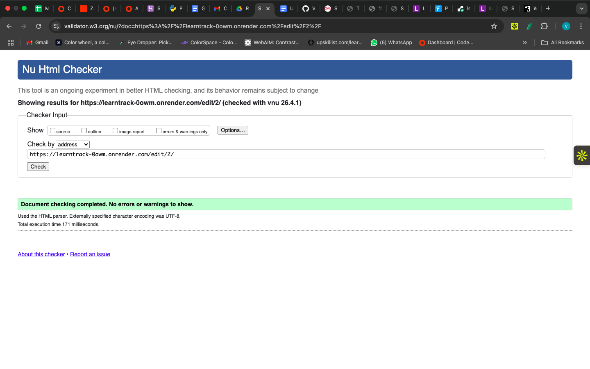
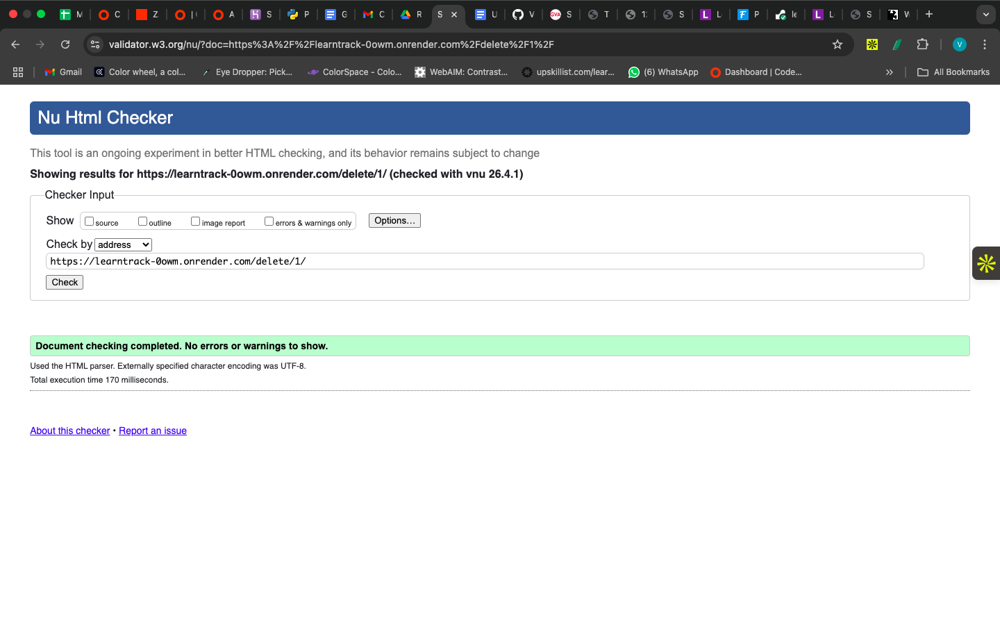
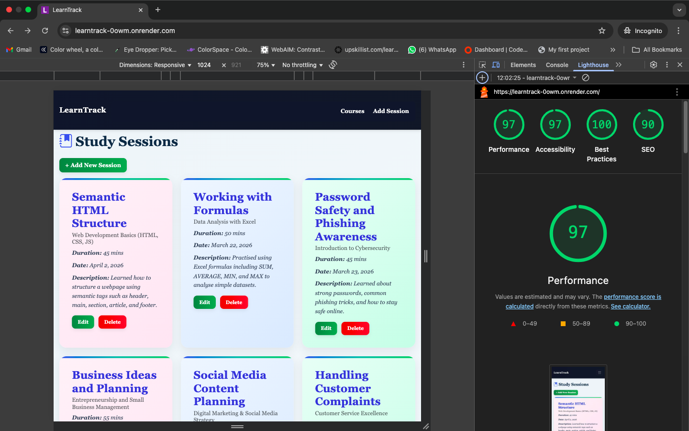
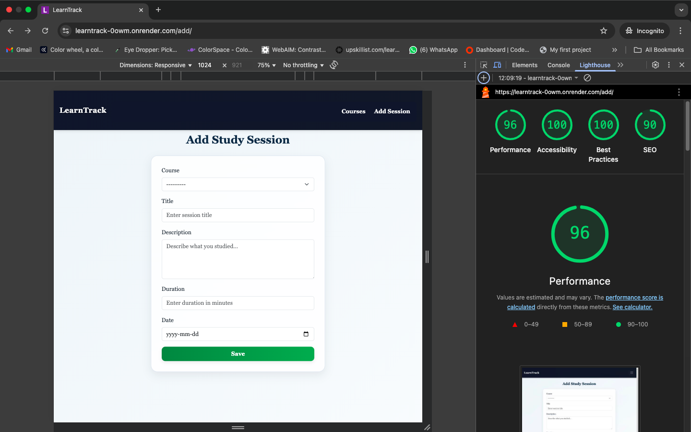
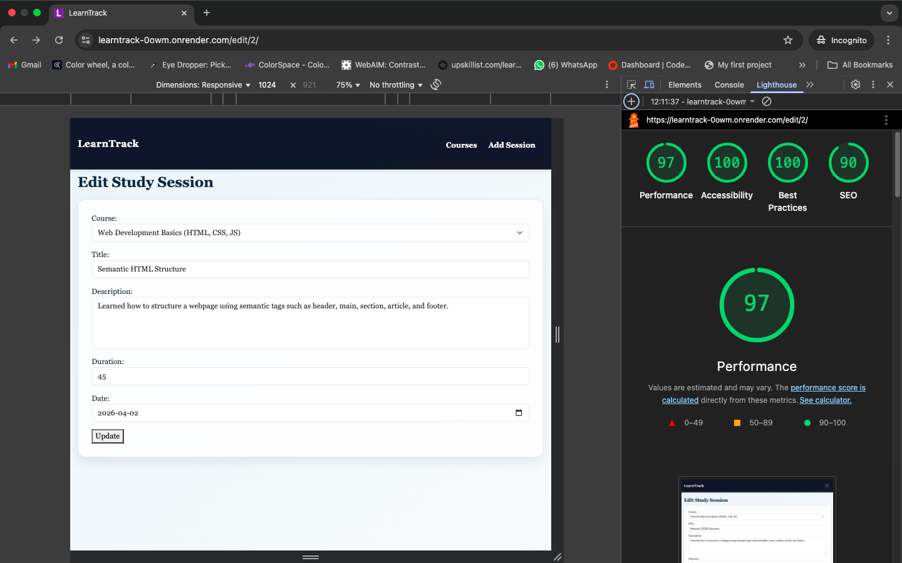
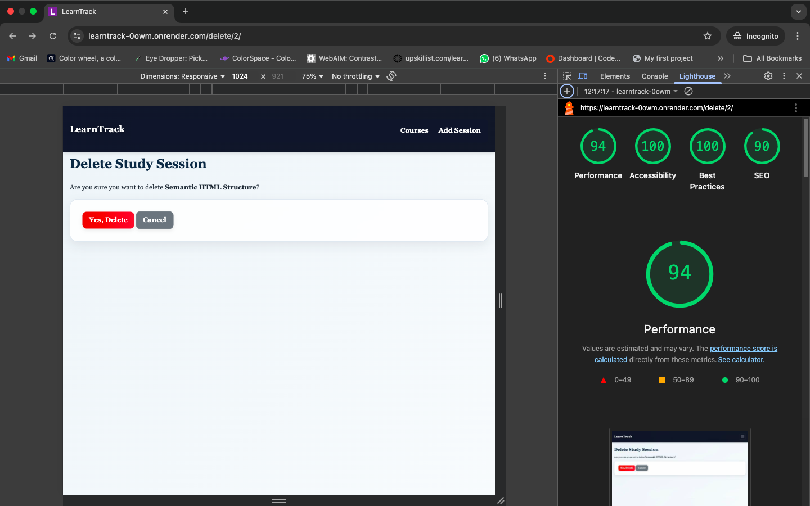
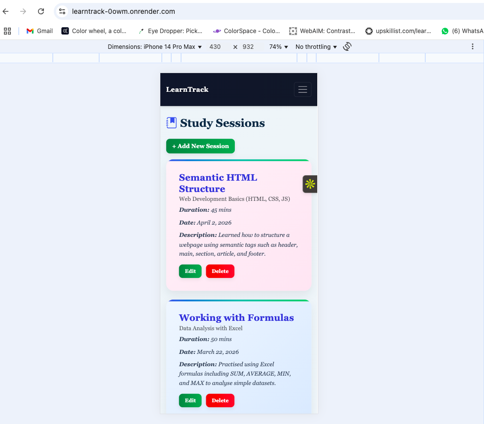
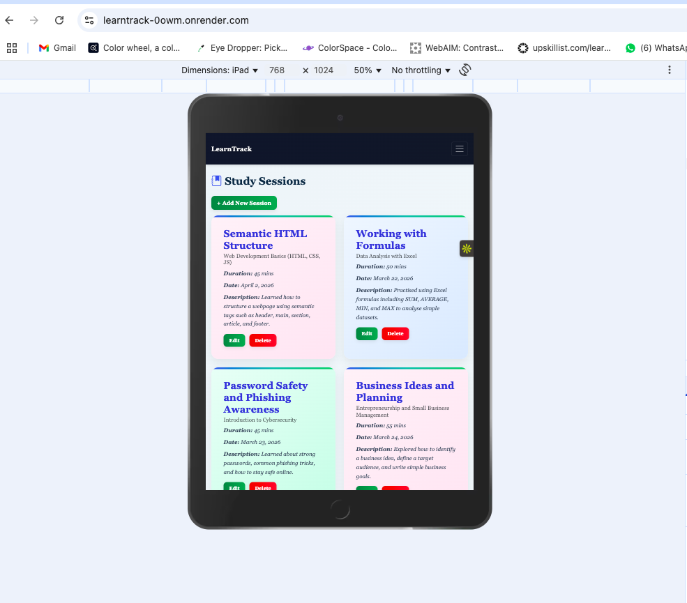
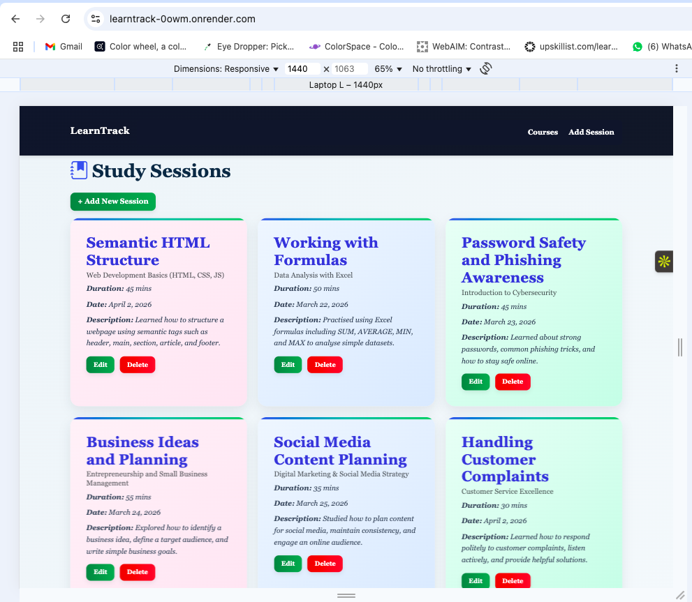

# LearnTrack – Testing

## Overview

Testing was carried out throughout the development of this project to ensure that all functionality works as expected.

The application was tested manually in both local and deployed (Render) environments.

---

## CRUD Functionality Testing

### 1. Create (Add Study Session)

- Users can fill out the form and submit a new study session  
- Required fields prevent empty submissions  
- Date picker allows easy date selection  
- After submission, the session appears on the homepage  

**Result:** ✅ Pass  

---

### 2. Read (View Study Sessions)

- All study sessions are displayed on the homepage  
- Sessions are shown in a structured card layout  
- Each card displays:
  - Title  
  - Course  
  - Duration  
  - Date  
  - Description  

**Result:** ✅ Pass  

---

### 3. Update (Edit Study Session)

- Users can click the "Edit" button  
- Existing data is pre-filled in the form  
- Changes are saved correctly  
- Users are redirected back to the homepage  
- A success message is displayed  

**Result:** ✅ Pass  

---

### 4. Delete (Remove Study Session)

- Users click the "Delete" button  
- JavaScript confirmation prompt appears  
- Django confirmation page is displayed  
- Users can confirm or cancel deletion  
- After deletion, the session is removed  
- A success message is displayed  

**Result:** ✅ Pass  

---

## Form Validation Testing

- Required fields prevent empty submissions  
- Validation errors are displayed when fields are missing  
- Users cannot submit invalid data  

**Result:** ✅ Pass  

---

## Database Testing
  
- SQLite database used during development
- PostgreSQL used in production (Render)
- Data persists correctly after deployment
- Relationships between Course and StudySession work correctly  
- Each study session is linked to a course  

**Result:** ✅ Pass  

---

## Responsiveness Testing

The application was tested across multiple screen sizes:

- Mobile devices  
- Tablets  
- Desktop  

Bootstrap grid system ensures layout adapts correctly across all devices.

**Result:** ✅ Pass  

---

## Deployment Testing

The deployed version was tested with DEBUG-False to stimulate a production environment.
- Application deployed successfully on Render  
- All CRUD operations function correctly on the live site  
- PostgreSQL database persists data correctly  
- Admin panel is accessible and functional  

**Result:** ✅ Pass  

---

## Lighthouse Testing

Lighthouse testing was conducted using Chrome DevTools on the deployed application.

### Results Observed:

- **Desktop Scores:**
  - Performance: High (90+)
  - Accessibility: 97–100  
  - Best Practices: 96–100  
  - SEO: 90  

- **Mobile Scores:**
  - Performance: Lower (approx. 65–75)  
  - Accessibility: 100  
  - Best Practices: 100  
  - SEO: 90  

### Explanation:

Lower mobile performance scores were primarily due to **third-party CDN resources**, including:

- Bootstrap CSS  
- Bootstrap JavaScript  
- Bootstrap Icons  

These introduce minor render-blocking behaviour during page load, which affects performance scores during Lighthouse testing.

Despite this:

- The application is fully functional  
- Pages load correctly  
- User experience is smooth  
- Accessibility and best practices scores are high  

**Result:** ✅ Pass  

---

## Validator Testing

### HTML Validation
All HTML pages were validated using W3C Markup validator. No major errors was found.

### CSS Validation
CSS was validated using the W3C CSS validator.

### PEP8 Validation
Python code was tested using Flake8 to ensure PEP8 compliance.
Initial testing identified line length issues (E501), which were resolved by refactoring the code.
After corrections, flake8 returned no errors or warnings.

### Lighthouse Testing

### Responsiveness

---

## Bugs and Fixes

### 1. Course Dropdown Not Showing Options

**Issue:**  
Course dropdown was empty when adding a study session  

**Cause:**  
No course records existed in the database  

**Fix:**  
Added course entries via Django admin  

---

### 2. Admin Login Not Working

**Issue:**  
Unable to log into Django admin after deployment  

**Cause:**  
Database reset  

**Fix:**  
Reconfigured admin credentials  

---

### 3. Data Loss After Deployment

**Issue:**  
Study sessions and data disappeared after redeploy  

**Cause:**  
SQLite database is not persistent on Render  

**Fix:**  
Switched to PostgreSQL for persistent storage  

---

### 4. Static Files Not Loading

**Issue:**  
CSS was not applied correctly  

**Fix:**  
Configured static files properly using Django static settings  

---

### 5. Favicon Appearing Blurry

**Issue:**  
Favicon appeared unclear  

**Fix:**  
Replaced with properly sized and optimised icon  

---

## Conclusion

All core features of the application are functioning as expected.

The project covers the main requirements for assessment, including:

- CRUD functionality  
- Database integration  
- Deployment  
- Responsive design  
- Validation and testing  

The application is stable, and user-friendly.
